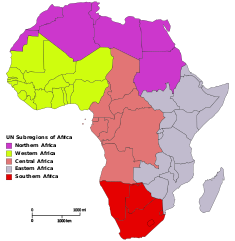
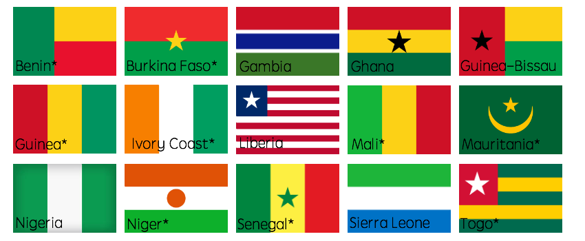

```{r echo=FALSE, include=FALSE, cache=FALSE}
knitr::opts_chunk$set(echo = TRUE)
source('crisisanalysis2.R')
```
##Contents{.body}  
- Introduction
- Countries in West Africa
- Comparing crisis across the 15 countries in west africa
- Crisis Comparison across Months
- Chi-Square Test
- Conclusion
```{r}

```

##**Introduction**{.body}  
 
 

Africa is the second largest continent in the world. Consisting of 5 regions(Northern, Eastern, Western,Southern and Central). The advent of crisis in the western African region has affected the economy of the region. My analysis is based on crisis level within the 15 countries in the western African region across the span of 21 years begining from 1997 to 16th April 2018.My aim was to find out if there was similarity in the level of crisis occurrences in the months across each year.

```{r}

```


## **Countries in West Africa**



```{r echo=FALSE, results='hide',message=FALSE}


```
##**Crisis analysis in each country**{.smaller}  
```{r echo=FALSE, results='hide',message=FALSE}
t
```

##**Timeseries plot for each country**{.body}  
From the Left:Nigeria,Sierra Leone,Niger,Liberia  
```{r echo=FALSE, results='hide',message=FALSE}
grid.arrange(Plot1,Plot2,Plot3,Plot4)

```

##Timeseries contnd...{.body}   
From the left: Guinea,Senegal,Ivory Coast,Mauritania
```{r echo=FALSE, results='hide',message=FALSE}
grid.arrange(Plot5,Plot6,Plot7,Plot8)
```

##Timeseries contnd...{.body}  
From the left: Guinea-Bissau,Burkina Faso,Gambia,Ghana,
```{r echo=FALSE, results='hide',message=FALSE}
grid.arrange(Plot9,Plot10,Plot11,Plot12)
```

##Timeseries contnd...{.body}  
From the left:Togo,Benin,Mali  
```{r echo=FALSE, results='hide',message=FALSE}
grid.arrange(Plot13,Plot14,Plot15, ncol=2)
```

##Timeseries contnd...{.smaller}  
```{r echo=FALSE, results='hide',message=FALSE}
p1
```

##**Monthly comparison in each year**{.smaller}

```{r echo=FALSE,message=FALSE}
g
```

##**Chi-Square Test**{.smaller}  
Formular: $$x^{2}=\sum \frac{(observed -expected)^{^{2}}}{expected}$$
 
```{r echo=FALSE,message=FALSE}
Chi
```

##**Conclusion**{.body}  
The crisis rate in the western african region has existed since 1997, though the occurence in most countries has significantly dropped.In some other areas, there have been recent occurences(Nigeria).This can be clearly seen from the different graphical representations of the crisis trend across 21 years.The Basis of my analysis was to compare the occurences within months across the different years, to know if the rate of occurrence is relational to the month(season).   

To do this, the chi-square test was used.Based on the resulting p-value,i cannot statistically conclude that this relationship exists.However,pertinent contributory factors to these conflicts include poverty, human rights violations, bad governance and corruption, ethnic marginalization and small arms proliferation.

##**References**{.body}  
-*Annan, Nancy. "Violent Conflicts and Civil Strife in West Africa: Causes, Challenges and Prospects." Stability: International Journal of Security and Development, 28 Jan. 2014, www.stabilityjournal.org/articles/10.5334/sta.da/.*  

-*Data source was from acled data*